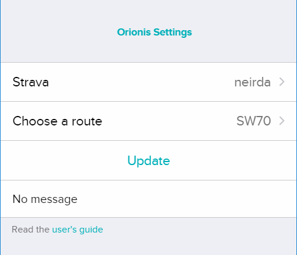

# Orionis

Navigate a route during an exercise with Fitbit Ionic

Visit url https://gallery.fitbit.com/details/9897b324-9be2-4171-b6bd-f1e978d57298 from your smartphone to install the application (Fitbit app must be already installed).

## User guide

A Strava account is required.
1. On Strava's website, after logging in, star only one of your routes in Dashboard/My routes
2. On Orionis Settings, logging to Strava and then click the Update button. The route's name (starred in Strava) should be displayed.

3. Start Orionis on your Fitbit Ionic :

- select the type of activity (Run, Cycling, Hiking) by tapping the cog wheel in the upper left corner and validate

- Tap the arrow in the bottom right corner to start GPS
- Wait until GPS is found, and you'll be able to start your activity on tapping the arrow in the bottom right corner.

- Tap the pause button in the bottom right cornenr and then the flag button in the upper right corner when exercise is finished. Exercise can also be paused and resumed using the pause/play button.

3 displays are available during exercice : statistics, global map (whole route), local map (500m around you)

  

**Remarks** :
- Exrcice can start only when GPS is found.
- Route is simplify to have less than 100 points.
 
**Disclaimer** :
I do not make any warranties about completeness, reliability and accuracy of this application. Any action you take upon the use of this app is strictly at your own risk.

## Developer guide
1. Clone repository

2. `env.js.example` file must be renamed `env.js` and modified (adjust Strava's `clientId` and `clientSecret` values).

2. Run command `npx fitbit` then `bi` (`build` and `install`)